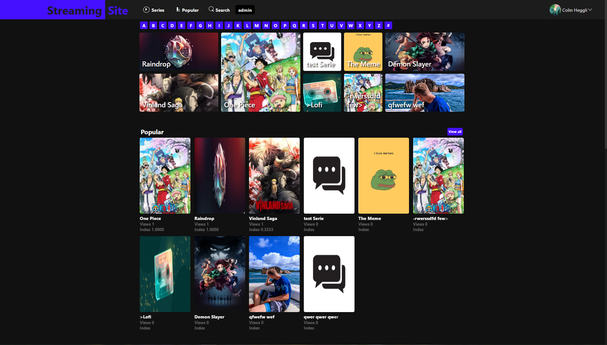

# StreamingSite

## TODO after clone
```bash
$ npm install
```
# CSS
### start laravel-mix
```bash
$ npm run dev
```
### Link CSS
```html
<link rel="stylesheet/less" type="text/css" href="/dist/css/main.css"/>
```


### Link JQuery
```html
<script src="https://ajax.googleapis.com/ajax/libs/jquery/1.10.2/jquery.min.js"></script>
```

### Link VUE.js
```html
<script src="https://unpkg.com/vue@3/dist/vue.global.js"></script>
```
### Link css icons
```css
@import url('https://use.fontawesome.com/releases/v6.1.2/css/all.css');

@import url('https://css.gg/css');
```
### Symbol Country Flags
<a href="https://github.com/lipis/flag-icons/tree/29edfe0288970b77976024832f1f3cf0a8667357">Link Github</a>
<br>
```html
<span class="fi fi-xx"></span>
```

# SQL
<a href="https://drawsql.app/teams/fdagadsgdsfg/diagrams/copy-of-copy-of-connect-information">Data Model: drawsql.app</a>

# Config with XAMPP
## Max Upload
The following lines have to be updated in the **php.ini** file.
````
upload_max_filesize=5000000M

post_max_size=5000000M
````
## Work Directory
The following lines has to be the Directory where your local copy of the Git repo is 
````
DocumentRoot "C:/xampp/htdocs"

<Directory "C:/xampp/htdocs">
````
## Mod rewrite 
This Line is a comment, remove the `#` so that it locks like this:
```
LoadModule rewrite_module modules/mod_rewrite.so
```
and Chang this:

```
AllowOverride None
```
to this:
```
AllowOverride All
```
# Documentation
Here are the inputs and outputs of the API documented <br>
<a href="docu/">/docu/*.md</a>

Copyright <br>
Colin Heggli and Niklaus Kuelling <br>
2023
<style>
body{
    background-color: rgb(17, 17, 17);
}
/** {*/
/*    color: #fff;*/
/*}*/
a {
    color: #4410FFFF;
}
</style>
